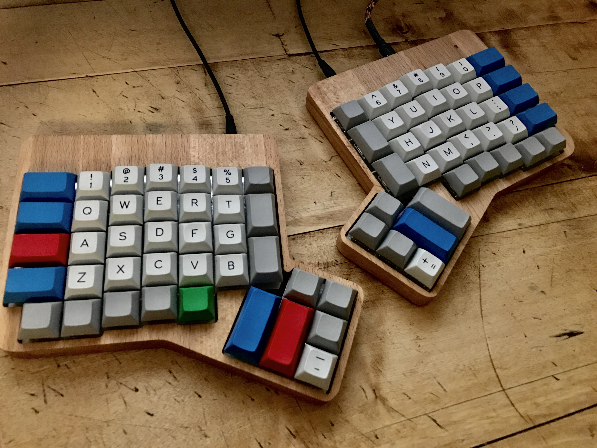

Ergodox
=======



## Assembly

All parts were ordered from [falbatech.pl](https://falbatech.pl):
  * Beach Wood case
  * CNC Plate for 76 keys
  * Ergodox PCB set
  * Teensy 2.0
  * SMD electronics
  * R2 78gr. Zealios switches (from [zealpc.net](https://zealpc.net/))
  * PMK keycaps

The board was assembled by myself and required quite a lot of soldering, but
it's fairly straightforward when following one of the many guides out there.
The soldering of the SMD parts is tedious, but not that challenging. When
using falbatech's Beach Wood case, make sure to read their remarks regarding
the teensy. It's required to desolder the female mini usb port from the
teensy! Otherwise the PCB won't fit the case. Replacing the connector on the
board needs a very precise soldering job.


## Flashing

*I used the [21ee3eb](https://github.com/jackhumbert/qmk_firmware/tree/21ee3eb569caffdf2ad581c668682c0109c978e5)
commit at the time of writing this guide.*

Qmk has a few [nice additions](https://github.com/jackhumbert/qmk_firmware/tree/21ee3eb569caffdf2ad581c668682c0109c978e5#going-beyond-the-keycodes),
and some of them are in my `ergodox` keymap, like the Space Cadet Shift.

Compiling the qmk repository was no problem at all (on 10.11). For flashing the
`teensy` the console tool need to be installed.

```
$ brew install teensy_loader_cli
```

Compiling and flashing the customized keymap is done with:

```
$ make KEYMAP=nce teensy
```

## Keymap
### German Umlauts on US Keyboard Layout
On macOS there is no simple way to output german umlauts using the US Keyboard
layout. Even when switching to Unicode and applying mac specific unicode
combinations.

Therefore i've utilized Macros simulating umlauts on the **US International**
keyboard layout (<kbd>ALT</kbd> + <kbd>u</kbd>,
<kbd>o</kbd> → ö)

> Currently this doesn't support uppercase umlauts

### Default
```
 ,--------------------------------------------------.           ,--------------------------------------------------.
 | Esc    |   1  |   2  |   3  |   4  |   5  |  =   |           | RIGHT|   6  |   7  |   8  |   9  |   0  |   -    |
 |--------+------+------+------+------+-------------|           |------+------+------+------+------+------+--------|
 | Tab    |   Q  |   W  |   E  |   R  |   T  |  L1  |           |  L1  |   Y  |   U  |   I  |   O  |   P  |   \    |
 |--------+------+------+------+------+------|      |           |      |------+------+------+------+------+--------|
 | Ctrl   |   A  |   S  |   D  |   F  |   G  |------|           |------|   H  |   J  |   K  |   L  |; / L2|' / Cmd |
 |--------+------+------+------+------+------| Lbkt |           | Rbkt |------+------+------+------+------+--------|
 | LShift |   Z  |   X  |   C  |   V  |   B  |      |           |      |   N  |   M  |   ,  |   .  |//Ctrl| RShift |
 `--------+------+------+------+------+-------------'           `-------------+------+------+------+------+--------'
   |Grv/L1| Lgui |  `~  |  '"  | Lgui |                                       |  Up  | Down |   [  |   ]  | Rgui |
   `----------------------------------'                                       `----------------------------------'
                                        ,-------------.       ,--------------.
                                        | Del  | Alt  |       | Alt |Ctrl/Esc|
                                 ,------|------|------|       |------+-------+-------.
                                 |      |      | Home |       | MDIA |       |       |
                                 | Back |  Esc |------|       |------| Enter | Space |
                                 | spac |      | End  |       | PgDn |       |       |
                                `--------------------'       `----------------------'
```

### Function Layer
```
,--------------------------------------------------.           ,--------------------------------------------------.
|Version |  F1  |  F2  |  F3  |  F4  |  F5  |      |           |      |  F6  |  F7  |  F8  |  F9  |  F10 |   F11  |
|--------+------+------+------+------+-------------|           |------+------+------+------+------+------+--------|
|        | MPrv | MPly | Mnxt | Wref |      |      |           |      |      |  ü   |      |  ö   |      |   F12  |
|--------+------+------+------+------+------|      |           |      |------+------+------+------+------+--------|
|        |  ä   |  ß   |  €   |      |      |------|           |------| Left | Down |  Up  | Rght |      |        |
|--------+------+------+------+------+------|      |           |      |------+------+------+------+------+--------|
|        | VolD | VolU | Mute |      |      |      |           |      |      | Mail |      |      |      |        |
`--------+------+------+------+------+-------------'           `-------------+------+------+------+------+--------'
  |      |      |      |      |      |                                       |      |      |      |      |      |
  `----------------------------------'                                       `----------------------------------'
                                       ,-------------.       ,-------------.
                                       |      |      |       |      |      |
                                ,------|------|------|       |------+------+------.
                                |      |      |      |       |      |      |      |
                                |      | PWR  |------|       |------| POWER|      |
                                |      |      |      |       |      |      |      |
                                `--------------------'       `--------------------'
```
