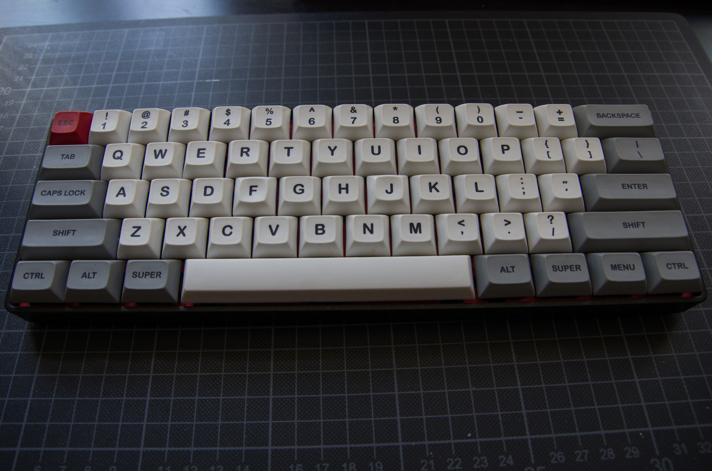

GH60 Custom Layout
==================

This document describes my custom firmware which I used for the fully
programmable [GH60 china clone](docs/gh60pcb.jpg) (hx60) PCB.




The displayed keyboard was assembled with:
  * GH60 China Clone hx60
  * Cherry stabilizers
  * Cherry MX-Clear switches
  * Black 60% plastic-mold case
  * Signature Plastics DSA pbt sublimated series (GDE & WAN)

## Pok3r

The pok3r layout provided by tmk, does not represent the *original pok3r* layout.
My [keymap](keymap_pokerorg.c) is a more native implementation of the *pok3r*,
based on hasu's pok3r version.

### Default Layer

*A keycode table explaning all the abbrevations is available [here](https://github.com/tmk/tmk_keyboard/blob/master/tmk_core/doc/keycode.txt).*

```
,-----------------------------------------------------------.
|Esc|  1|  2|  3|  4|  5|  6|  7|  8|  9|  0|  -|  =|Backsp |
|-----------------------------------------------------------|
|Tab  |  Q|  W|  E|  R|  T|  Y|  U|  I|  O|  P|  [|  ]|    \|
|-----------------------------------------------------------|
|Caps  |  A|  S|  D|  F|  G|  H|  J|  K|  L|  ;|  '|Return  |
|-----------------------------------------------------------|
|Shift   |  Z|  X|  C|  V|  B|  N|  M|  ,|  .|  /|Shift     |
|-----------------------------------------------------------|
|Ctrl|Gui |Alt |       Space             |Alt |FN |Gui |Ctrl|
`-----------------------------------------------------------'
```

By pressing <kbd>Menu</kbd> (FN) you can switch to the `function layer`.


### Function Layer

```
,-------------------------------------------------------------.
|Grv| F1| F2| F3| F4| F5| F6| F7| F8| F9|F10|F11|F12| Del     |
|-------------------------------------------------------------|
|FnQ |Mprv|Mply|Mnxt| | |Calc|Pgup|Up |Pgdn|Pscr|Slck|Paus|FnL|
|-------------------------------------------------------------|
|      |   |VolD|VolU|Mute|  |Home|Left|Down|Rght|Ins|Del|    |
|-------------------------------------------------------------|
|        |App|   |   |   |   |End|   |   |    |    |          |
|-------------------------------------------------------------|
|    |    |    |           FnS            |    |    |    |    |
`-------------------------------------------------------------'
```
> FnS: toggle Arrow overlay

> FnQ: toggle GRV overlay

> FnL: to Layout selector overlay

The **arrow**-overlay transforms the bottom right side of the Keyboard into an
arrow cluster:

```
    ...            ;|  '|Return  |
   ...       --------------------|
  ...        ,|  .|  /|   Up     |
          -----------------------|
   Space    |FN0 |Left|Down|Right|
---------------------------------'
```

The **Grv**-overlay transforms <kbd>ESC</kbd> to `` ` ``

### Alternative Layouts
As a custom Keyboard is usually lacking Dip-switches, we need another
method to switch layouts.

Therefore a layout selector layer is introduced by pressing
<kbd>Menu</kbd> + <kbd>\\</kbd> **and** one of the following keys simultaneously:


```
,-----------------------------------------------------------.
| Lq| Lc| Ld| Lw|   |   |   |   |   |   |   |   |   |       |
|-----------------------------------------------------------|
|     |Lq |Lw |   |   |   |   |   |   |   |   |   |   |     |
|-----------------------------------------------------------|
|      |   |   |Ld |   |   |   |   |   |   |   |   |        |
|-----------------------------------------------------------|
|        |   |   |Lc |   |   |   |   |   |   |   |          |
|-----------------------------------------------------------|
|    |    |    |                        |    |    |    |    |
`-----------------------------------------------------------'
```
> Lq: QWERTY layout

> Lc: Colemak layout

> Ld: Dvorak layout

> Lw: Workman layout

This is a permanet switch, until it is manually "reversed" to QWERTY via
<kbd>Menu</kbd> + <kbd>\\</kbd> + <kbd>ESC</kbd>

## HHKB

My *happy hacking 60%*-[layout](keymap_hh60.c) was a temporary solution to simulate a kind of
HHKB layout on the classic 60% keyboard (mostly by mapping `Control` to `Capslock`
and switching `Backspace` with `\`).

It features a `vim` styled arrow cluster (`hjkl` movement) and a long pressed
<kbd>;</kbd> function layer switch.

*Note: atm the source code comments dont reflect the actual code*

## Firmware Flashing

*Note: this is a guide for a MacOS Setup using the
[d4982a2](https://github.com/tmk/tmk_keyboard/tree/d4982a21ac8f3ba003da41ceb581bffb4e78fefa) commit of the tmk repo*

Flashing a new Layout is pretty straightforward with the - non graphical -
[tmk](https://github.com/tmk/tmk_keyboard) suite. The necessary tools are
the `AVR Toolchain` and `dfu-programmer` (more on that, in the build
instructions there).

After setting up the custom key layout, compile the layout to a hex file by
running `make` in the respective directory of the cloned tmk repo.

By copying (my) keymaps in the directory, they can be compiled via:

```
$ make KEYMAP=name
```

Where `name` is representing the filename of the custom layout
(eg. `keymap_name.c`).

The resulting hex file can now be flashed onto the connected keyboard,
after **a short press on the
button on the bottom** of the keyboard and running:

```
$ make dfu
```


