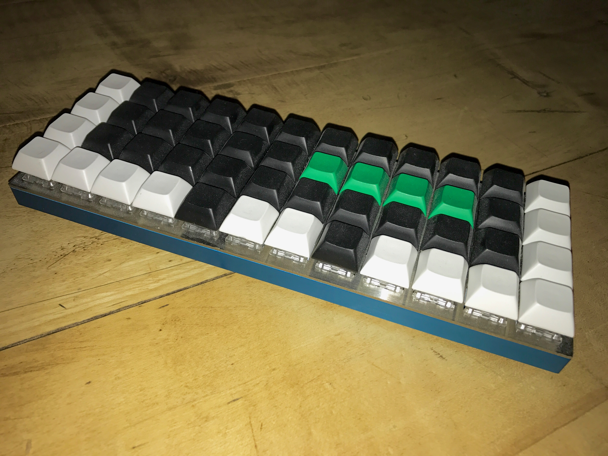

Planck
======

## Assembly

The keyboard parts were purchased directly from Jack at [olkb.com](http://olkb.com).
  * Blue Case
  * MIT Layout Plate
  * rev4 PCB
  * R3 78gr. Zealios switches for the mods
  * R3 67gr. Zealios switches for the alpha keys

The assembly is straightforward and without surprises.

## Flashing

## Keymap

### Programming
Access to the frequently used parenthesis is provided through "Space Cadet".
Taping Shift results in a single opening/closing parenthesis, depending on
which shift is used. Holding shift defaults to its common behaviour.
Lowering the Layer provides brackets on the same keys, as raising the layer
outputs curly braces.

The rest of the layout mimics [my ergodox](../ergodox/readme.md) behaviour.
